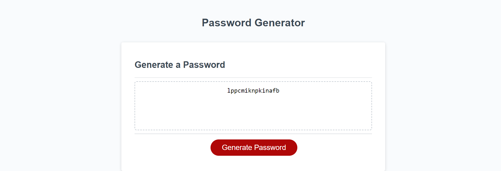

# Password_Generator

## Description

This project utilizes javascript to ask the user, via prompts, to generate a random password. Possible options to generate a password are special characters, numbers, a-z, and if they want upper and lowercase letters. However, if the user specifies a number for the password but does not select any of the following prompts then an error message is displayed. Otherwise a password is generated with the user selected preferences. 

A particular funny issue occured when I was trying to get the user length for the password. I had set the code to make a password denpending on the length of the input. However, what I really wanted  and needed to do was get the user input and change it to a number value. I did this by using the parseInt() function. I spent a good 5 min getting stumpted by this error. 
Here is the code snippet:
```
for (var i = 0; i < parseInt(passwordLength); i++) {
    generatedPass = generatedPass + 
    arrayConversion.charAt(Math.floor(Math.random() * (passwordLength + 1)));
    console.log(generatedPass);
  }
```

Here is a screenshot of a generated password:


The following code snippet gives the user a prompt and depending on how they answer affects how the password is generated. Here is the code snippet for the prompts to the user:
```
// this is a prompt asking if the user wants uppercase
function askUpper() {
  var upperChar = false;
  if (confirm("Do you want uppercase char?")) {
    upperChar = true;
    return upperChar;
  } else {
    return upperChar;
  }
}
```

## Installation

No installation required. Simply go to github page for viewing.

Here is the link to look see how I built the webpage with HTML, CSS, and javasript.
[Github Repo](https://github.com/johnfrom209/Password_Generator)

[Deployed Page](https://johnfrom209.github.io/Password_Generator/)

## Usage

By going to the deployed page link, you can try out the password generator. Start by clicking on the "Generate Password" button. The first prompt will ask for an input, please enter a number higher than 8 but less than 128. After that you will get a series of prompts for how you want the password to generate. By clicking "ok" means you are okay with them in the password. Hitting "Cancel" will register as a no and not be included in the final password generation. Refer to the screenshot for a sample of a random password generation.

## Credits

Starter code was given by UCB coding bootcamp.

## Contact Me

[Linkedin](https://www.linkedin.com/in/johnfrom209/)

[View my Github Repo](https://github.com/johnfrom209)

## License

Refer to the license in the Github repo.